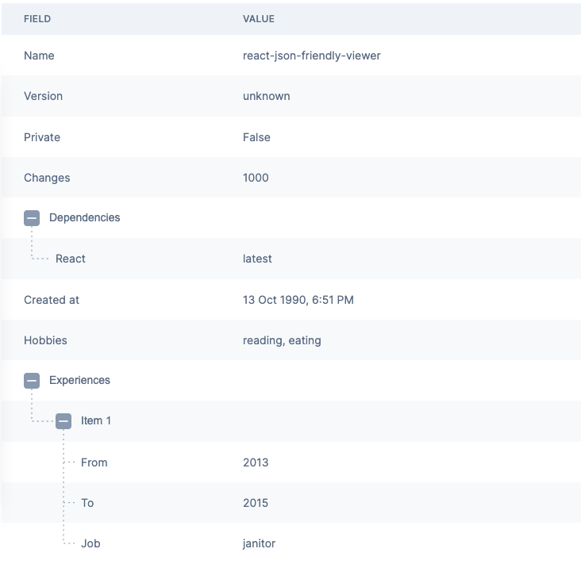

# react-json-friendly-viewer

Beautifully display your JSON data for everyone.

```bash
npm install react-json-friendly-viewer
```

## Usage

Import the component and pass any json object to `json` props.

```jsx
import { JsonPrettyViewer } from 'react-json-friendly-viewer';

<JsonPrettyViewer
	json={{
		name: 'react-json-friendly-viewer',
		version: 'unknown',
		private: false,
		changes: 1000,
		dependencies: {
			react: 'latest',
		},
		createdAt: '1990-10-13T10:51:05.570Z',
		hobbies: ['reading', 'eating'],
		experiences: [
			{
				from: '2013',
				to: '2015',
				job: 'janitor',
			},
		],
	}}
/>;
```

The following table will be displayed.


